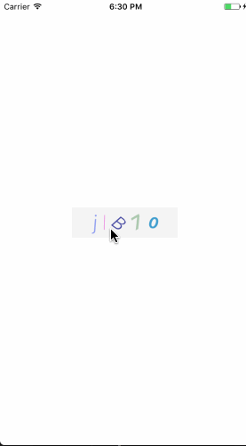
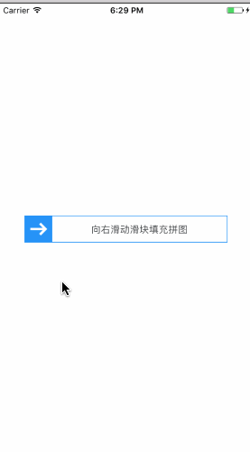

# react-native-verification



### Documentation

#### Params

|Key | Description | Type | Default|
| --- | ----------- | ---- | ------ |
|type         |   验证码类型                 |string  | 'img','number'
|stringArr    |   数字验证码-内容数组         |array   |["1",...,"a",...,"A",...]    |
|fontWeight   |   数字验证码-字体宽度         |array   |['normal','bold','100',...]  |
|num          |   数字验证码-数字个数         |number  |4                            |
|minFont      |   数字验证码-最小字体         |number  |23                           |
|maxFont      |   数字验证码-最大字体         |number   |40                          |
|minDeg       |   数字验证码-最小旋转角度      |number   |-45                         |
|maxDeg       |   数字验证码-最大旋转角度      |number   |45                          |
|font         |   数字验证码-字号             |array   |['italic','normal']          |
|rightMove    |   图片验证码-滑块移动正确距离(比填)   |number  |164                     |               
|offset       |   图片验证码-滑块移动正确距离误差值         |number   |3                |
|itemImg      |   图片验证码-滑块图片         |object  |{uri:url} /require(url)       |
|backGroundImg|   图片验证码-滑块背景图片         |object   |{uri:url} /require(url)   |
|getValue     |   回调值，数字验证码返回随机内容，图片验证码显示true／false   |func   |     |


### Usage

#### Step 1 - install

```
	npm install react-native-verification --save
```


#### Step 2 - import and use in project

```javascript
    import Verification from 'react-native-verification'
```
```javascript
    <View style={{ 
      flex:1,
      alignItems:'center',
      justifyContent:'center',}}>
      <Verification 
          type={'img'} 
          getValue={(value)=>console.log(value)}  
         
          />
      <Verification 
          type={'number'} 
          getValue={(value)=>console.log(value)}  
         
          />
    </View>
	
```

